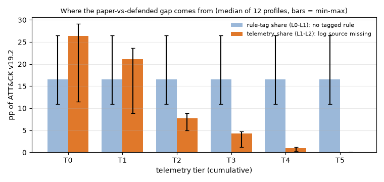
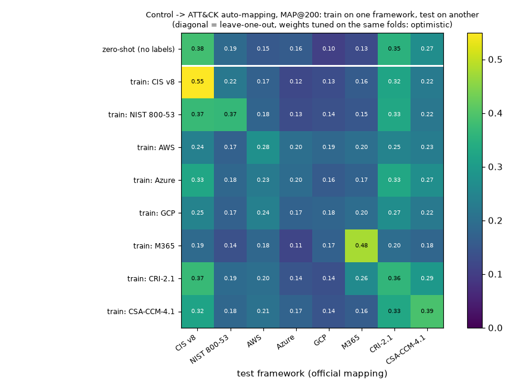
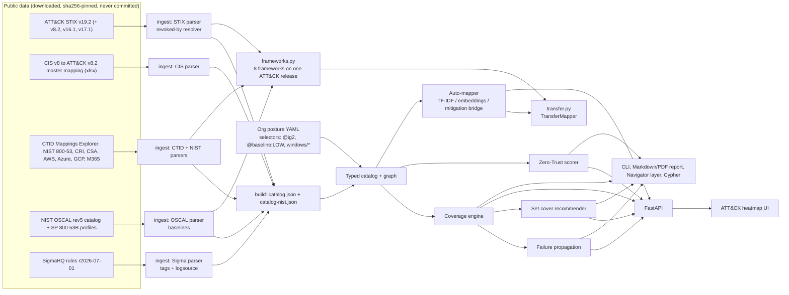

# VANTAGE

[](https://github.com/rakshit-737/vantage/actions/workflows/ci.yml)
[](https://rakshit-737.github.io/vantage/)
[](https://github.com/rakshit-737/vantage/actions/workflows/realdata.yml)
[](https://github.com/rakshit-737/vantage/releases)

[](LICENSE)


**Docs: <https://rakshit-737.github.io/vantage/>** · [static UI demo](https://rakshit-737.github.io/vantage/demo/) · image `ghcr.io/rakshit-737/vantage`

**VANTAGE joins your controls, your detections and MITRE ATT&CK into one graph, then shows the gap between *compliant* and *defensible*.**

**Contribution:** an open, reproducible measurement of how far control-mapping coverage overstates detection-backed coverage. Each ATT&CK technique is scored as the conjunction of an official control mapping (CIS v8, NIST SP 800-53B baselines and six CTID frameworks), a deployed SigmaHQ rule, and that rule's log-source dependencies. Across 12 framework profiles, paper coverage exceeds detection-backed coverage by 24-56 pp with classic Windows logs and still by 11-27 pp with every Sigma log source ([ablation](results/ablation.md)).

Organisations pass CIS or NIST audits and still get breached, because "we have a control" does not mean "we can detect the technique it is meant to stop". VANTAGE models the enterprise as a graph (Control → Technique ← Detection ← LogSource) with a segmentation/IAM trust layer. It works out which ATT&CK techniques are backed by a working detection and which are covered only on paper. It runs on **real public data**: the full ATT&CK Enterprise STIX bundle, the **official CIS Controls v8 → ATT&CK mapping**, the **CTID Mappings Explorer** mappings (NIST SP 800-53 rev5 with SP 800-53B baselines, CRI Profile, CSA CCM, AWS, Azure, GCP, M365), and the **SigmaHQ** ruleset (2,877 ATT&CK-tagged rules).

> **Lab-only / defensive.** VANTAGE is a read-only analysis tool that works on a *declared* posture file. It never scans, connects to, or changes any system, and it contains no exploit code. The org profiles are synthetic. The mappings and rules are public.


## Try it in 60 seconds

**Zero install:** open the [static demo](https://rakshit-737.github.io/vantage/demo/). It is the real UI, pre-rendered for the synthetic Acme posture on the real catalog.

**Local, offline:** install from the repo and run the demo on the bundled 33-technique seed catalog (no downloads):

```bash
pip install "git+https://github.com/rakshit-737/vantage"
vantage demo
```

```
== Acme Corp (synthetic) (33 techniques, 30 detections, 13 controls) ==
[1] Compliant but blind: claimed 93.9% vs true 45.5% (16 paper-only techniques, 8 dead rules)
...
```

CI installs the wheel into a fresh venv and times `vantage demo` on every push (job `package`, log line `demo took N s`). For the real catalog, see [Quickstart](#quickstart).

## Headline results (real data)

Every number below is in a committed result file, and every result file was produced by the `realdata` GitHub Actions run [37092934843](https://github.com/rakshit-737/vantage/actions/runs/37092934843) (commit `6ff466d`, ubuntu-24.04, Python 3.12.14), which it names in its footer and `provenance` block.

| Result | Number | Source |
|---|---|---|
| Paper minus detection-backed coverage, 12 framework profiles | 24.1-55.7 pp (T0 Windows logs), 10.9-26.5 pp (all Sigma log sources) | [ablation](results/ablation.md) |
| CIS IG2 claimed vs defended, classic Windows logs | 53.9% vs 11.2% (gap 42.8 pp) | [coverage](results/coverage.md) |
| Detection-only view (DeTT&CT-style) vs defended, CIS IG2, all log sources | 52.1% vs 37.4%; 88 of the 115 paper-only techniques are claimed only by non-Detect safeguards | [ablation](results/ablation.md) |
| NIST SP 800-53B LOW vs MODERATE paper coverage | 66.0% vs 66.9% of ATT&CK (MODERATE adds 6 techniques) | [cross-framework](results/crossframework.md) |
| Mitigation-bridge auto-mapper vs official CIS mapping | MAP@200 0.417 [0.357, 0.478] (MiniLM) vs prior 0.161; paired +0.256 [+0.192, +0.317], p < 0.0001 | [automap](results/automap.md) |
| Bridge minus direct text match, paired, 8 frameworks | TF-IDF +0.017 to +0.238 MAP (Holm p < 0.05 on 5 of 8); MiniLM +0.011 to +0.258 (4 of 8) | [cross-framework](results/crossframework.md) |
| Labels from the 7 other frameworks minus zero-shot, paired | TF-IDF +0.028 to +0.102 MAP (Holm p < 0.05 on 4 of 8: AWS, GCP, M365, CSA CCM); MiniLM +0.020 to +0.189 (the same 4) | [cross-framework](results/crossframework.md) |
| Greedy log-source recommender vs exact ILP | equal at all 7 budgets tested | [recommend](results/recommend.md) |

All numbers come from `benchmarks/*.py` run on ATT&CK v19.2 (697 techniques), CIS v8 (153 safeguards, 2,919 mapped pairs) and SigmaHQ r2026-07-01 (2,877 rules over 116 log sources). Intervals are 95% bootstraps; paired differences carry a sign-flip permutation test, Holm-adjusted over the 16 cross-framework tests per encoder. Per-control scores are committed, so every paired number can be recomputed. The full tables are in [`results/`](results).

**1. Paper and detection evidence diverge by 13-43 percentage points (CIS).** Suppose an org claims every CIS IG2 safeguard and deploys all stable and test Sigma rules. With only classic Windows event logs, its *claimed* coverage is 53.9% but its *defended* (detection-backed) coverage is 11.2%. Even with every Sigma log source ingested, it only reaches 37.4%.

| Telemetry tier (CIS IG2 claimed) | log sources | claimed % | detectable % | defended % | gap (pp) |
|---|---:|---:|---:|---:|---:|
| T0 classic Windows event logs | 3 | 53.9 | 13.2 | 11.2 | 42.8 |
| T1 + PowerShell logging | 8 | 53.9 | 22.0 | 16.5 | 37.4 |
| T2 + Sysmon/EDR-class endpoint | 31 | 53.9 | 41.3 | 29.4 | 24.5 |
| T3 + cloud & identity audit | 46 | 53.9 | 46.1 | 32.7 | 21.2 |
| T5 every Sigma log source | 116 | 53.9 | 52.1 | 37.4 | 16.5 |

Weighting each defended technique by rule quality (Sigma level × status, noisy-OR; [ADR 0007](docs/adr/0007-rule-quality-weighting.md)) lowers the defended share by another 2-4 pp (T5: 37.4% → 33.5%). With **NIST SP 800-53 rev5** claims instead (every mapped control, [ADR 0008](docs/adr/0008-nist-800-53.md)), paper coverage rises to 66.9% but defended coverage only to 40.3% at T5, so the gap is wider: 26.5 pp (55.7 pp at T0).

Across 100 random synthetic orgs (25 seeds per level), the mean gap (± one standard deviation across orgs) falls from 33.3 ± 5.2 pp (maturity 0.2; 95% CI of the mean 31.2-35.4) to 20.1 ± 1.5 pp (maturity 0.8; CI 19.4-20.7). Two structural ceilings show up ([coverage, section E](results/coverage.md)). The official CIS mapping touches only 54.2% of current ATT&CK. Of the 45.8 pp it cannot claim, 24.7 pp are techniques added after v8.2 (172 of them) and 21.1 pp are v8.2-era techniques that CIS never mapped (147). On v8.2 itself CIS covers 72.3%. SigmaHQ's stable and test rules can detect 52.1% even with every log source ingested (54.2% with all 2,877 rules).

**1b. The gap is not a CIS artefact; with classic logs most of it is telemetry.** The [ablation](results/ablation.md) adds the evidence requirements one at a time for 12 framework profiles. For CIS IG2 at T0, paper coverage is 53.9%. Requiring a tagged Sigma rule cuts it to 37.4%, and requiring that rule's log sources cuts it to 11.2%. NIST SP 800-53B MODERATE goes 66.9% → 40.3% → 11.2%, and AWS goes 30.6% → 19.7% → 5.9%. With classic Windows logs (T0) the telemetry share (L1-L2) is the larger part of the gap in 11 of 12 profiles. Once Sysmon-class endpoint logs are ingested (T2 and up) it is the larger part in none: most of what remains is claimed techniques that no deployed SigmaHQ rule is tagged with. The bracketed ranges in that table are a one-sided sensitivity check (a random 10% of rules removed), not confidence intervals, so they sit at or below the point estimate.




**What the control layer adds, and what "defended" does not mean.** A control mapping says a safeguard *could mitigate or detect* a technique, and most mapped CIS safeguards are Protect-function controls. A technique blocked by a preventive control is defended without any Sigma rule, so "paper-only" means *no detection evidence*, not *exposed*. The ablation measures this: at T5, 88 of CIS IG2's 115 paper-only techniques are claimed only by non-Detect safeguards (230 of 298 at T0). Next to a DeTT&CT-style detection-only view (52.1% detectable at T5), the control layer removes 102 detectable-but-unclaimed techniques and leaves 37.4% detection-backed and claimed.


**2. Auto-mapping controls to ATT&CK, validated against the official CIS mapping.** Each mapper sees only the safeguard's title and description. Scores are macro-averaged over the 105 mapped safeguards (ATT&CK v8.2, labels as published). 95% bootstrap intervals (1,000 resamples of safeguards) are in [`results/automap.md`](results/automap.md); for example MAP@200 is 0.343 [0.281, 0.401] for the TF-IDF bridge vs 0.161 [0.129, 0.196] for the popularity prior (paired difference +0.182 [+0.120, +0.239], sign-flip p < 0.0001). The random row is the mean over 10 seeds.

| Mapper | P@10 | R@20 | R@50 | MAP@200 |
|---|---:|---:|---:|---:|
| random baseline (10-seed mean) | 0.055 | 0.040 | 0.097 | 0.031 |
| popularity prior (leave-one-out) | 0.206 | 0.147 | 0.330 | 0.161 |
| TF-IDF → technique text | 0.162 | 0.162 | 0.271 | 0.120 |
| MiniLM embeddings → technique text | 0.166 | 0.180 | 0.293 | 0.130 |
| **mitigation bridge (TF-IDF)** | 0.311 | 0.347 | 0.550 | 0.343 |
| **mitigation bridge (MiniLM)** | 0.384 | 0.395 | 0.621 | **0.417** |
| mitigation bridge (bge-small) | **0.388** | **0.418** | **0.623** | 0.412 |

Matching control prose directly to adversary-behaviour prose does no better than the popularity prior (TF-IDF: −0.041 [−0.081, −0.004]). Routing through ATT&CK *mitigations* instead (control text → nearest Mxxxx → the techniques it mitigates) gives 2.6× the prior's MAP, with no training and no CIS labels. There is no significant difference between the MiniLM and bge-small bridges (paired MAP@200 difference +0.005 [−0.044, +0.054], p = 0.84). It is still far from expert level: P@10 = 0.38 against an oracle ceiling of 0.75, since 47 of 105 safeguards have fewer than 10 gold techniques.

**Caveat:** CIS (and CTID for NIST) built their mappings through ATT&CK mitigations. Every CIS gold pair lies inside the techniques of the safeguard's CIS-assigned mitigations, so on CIS the bridge partly recovers CIS's own mitigation assignment. The text step still adds signal: the bridge is well above the popularity prior. On CRI Profile, CSA CCM, AWS and GCP the TF-IDF bridge beats direct text matching by a paired +0.05 to +0.24 MAP; after Holm adjustment that holds for CRI, CSA CCM and GCP, not AWS, and for Azure and M365 the interval includes 0 ([cross-framework](results/crossframework.md)). The bridge idea is prior work; see [Related work](#related-work) and [ADR 0005](docs/adr/0005-mitigation-bridge-automapper.md).

**2b. Train on one framework, test on another (v1.1.0).** Each of 8 frameworks (CIS v8, NIST 800-53, CRI Profile v2.1, CSA CCM 4.1, AWS, Azure, GCP, M365) is scored over the ATT&CK release it was mapped against. CIS, NIST, CRI and CSA CCM are text-rich; the AWS, Azure, GCP and M365 security-stack mappings give only a product name. The pre-specified source pools every *other* framework's labels. With TF-IDF, pooled minus zero-shot is positive with Holm p < 0.05 on AWS, GCP, M365 and CSA CCM; NIST (+0.044 [+0.010, +0.075]) and CRI-2.1 (+0.056 [+0.006, +0.104]) have intervals above 0 but do not survive the adjustment. With MiniLM the same four frameworks are significant (AWS +0.189, GCP +0.119, M365 +0.116, CSA CCM +0.071); Azure (+0.041 [−0.019, +0.107]), CIS, NIST and CRI are not. Most *single* sources hurt on the text-rich frameworks: 5-7 of 7 fall below zero-shot. In-framework nested leave-one-out has the highest point estimate for CIS, NIST, CSA CCM and M365 (TF-IDF 0.531/0.383/0.432/0.452). It is not a ceiling everywhere: for CRI-2.1 pooled transfer scores higher (0.416 vs 0.390, paired −0.026 [−0.078, +0.029]), and nested LOO is below zero-shot for Azure under both encoders and for CRI-2.1 under MiniLM (0.333 vs 0.354). Those are point estimates with no detectable difference (e.g. Azure TF-IDF −0.019 [−0.079, +0.036], Holm p = 1). Full matrices, every paired test, the per-control scores and the [published-work comparison](results/published.md) are in `results/` ([ADR 0009](docs/adr/0009-cross-framework-transfer.md)).



**3. The greedy recommender matches the exact optimum.** The task is choosing which log sources to onboard under a budget. Starting from the Acme posture (153 techniques already detectable, 99 candidate sources), greedy equalled an exact ILP (scipy/HiGHS) at all seven budgets tested (1, 2, 3, 5, 8, 12, 20); this is an empirical result on this instance, not a guarantee, since greedy budgeted set cover is only approximate in general. It beat "most rules first" by up to 31 techniques. Against 50 random orders it found 3.9-16.8× their mean and 1.0-2.7× their 97.5th percentile. Its top pick is `windows/ps_script` (cost 1.15, unlocks 134 rules, +51 newly detectable techniques, +30 defended), followed by `windows/process_creation` (+101). The recommender maximises newly *detectable* techniques, not defended ones ([walkthrough](results/walkthrough.md)).

**4. Engine speed.** On the GitHub runner, one coverage pass over the full catalog takes 2.9 ms and the one-pass single-point-of-failure ranking 2 ms; brute-force recomputation of the same ranking takes 7.7 s, with identical output ([coverage, section C](results/coverage.md)).

## What it computes

A technique is **defended** only if (a claimed control mitigates it) AND (a deployed rule detects it) AND (every log source that rule needs is actually ingested). "Defended" is detection-backed coverage: a preventive control can block a technique that no rule detects.

| Status | Meaning |
| --- | --- |
| `defended` | claimed and detectable |
| `paper_only` | claimed by a control but not detectable ("compliant but blind") |
| `detected_only` | detectable, but no control claims it |
| `blind` | neither |

- **Coverage**: per-technique status, claimed % vs true %, per-tactic tables, and "deployed-but-dead" rules (the rule is deployed but its log source is missing).
- **Failure propagation**: ranks every log source and rule by how many techniques go dark if it fails, and every claimed control by how many techniques lose their only claim (`--kind control`). Each ranking is a single pass and is property-tested against brute force.
- **Recommender**: greedy weighted set cover over "deploy rule" and "onboard log source (plus the rules it unlocks)" actions.
- **Zero-Trust scorer**: a 0-100 score from segmentation (flows weighted by criticality), MFA, PAM, device posture and account hygiene. It also lists the lateral-movement and discovery techniques exposed by open flows into critical segments.
- **Auto-mapper**: TF-IDF, sentence-embedding and mitigation-bridge mappers, plus a cross-framework TransferMapper, with an evaluation harness.
- **Outputs**: FastAPI + web heatmap with what-if toggles, a Markdown/PDF "compliant-but-undetectable" audit report, an ATT&CK Navigator layer, NetworkX JSON, and a Cypher script for Neo4j.

## Architecture



Code layout (`vantage/`): `ingest/` (`attack.py`, `cis.py`, `nist.py`, `ctid.py`, `oscal.py`, `sigma.py`, `build.py`), `download.py`, `frameworks.py`, `transfer.py`, `postures/`, `catalog.py`, `models.py`, `io.py`, `selectors.py`, `coverage.py`, `failure.py`, `recommend.py`, `zerotrust.py`, `automap.py`, `graph.py`, `navigator.py`, `report.py`, `pdf.py`, `api.py`, `web/`, `cli.py`. Offline toy data lives in `seed.py` and `synth.py`.

## Quickstart

```bash
git clone https://github.com/rakshit-737/vantage && cd vantage
pip install -e ".[dev]"                 # core + API + report + test deps
python -m vantage demo                  # offline toy catalog, no downloads

# real data (~190 MB): ATT&CK STIX, CIS v8 + CTID mappings, NIST OSCAL, SigmaHQ
export VANTAGE_DATA_DIR=$PWD/data       # or any folder outside the repo
python -m vantage.download              # resumable, sha256-verified
python -m vantage.ingest.build          # -> $VANTAGE_DATA_DIR/processed/catalog.json

python -m vantage demo      --catalog real
python -m vantage demo      --catalog nist                     # NIST SP 800-53 rev5 claims
python -m vantage coverage  --catalog real --org vantage/postures/acme-real.yaml
python -m vantage failure   --catalog real --top 10
python -m vantage failure   --catalog real --kind control --top 10   # controls that are the only claim
python -m vantage coverage  --catalog nist --org vantage/postures/acme-nist-low.yaml  # SP 800-53B LOW
python -m vantage recommend --catalog real --log-sources-only --steps 5
python -m vantage report    --catalog real --out report.md --pdf report.pdf
python -m vantage navigator --catalog real --out layer.json   # open in ATT&CK Navigator (git-ignored)
python -m vantage automap   --catalog real --method bridge "Require MFA for all remote access"
python -m vantage serve     --catalog real                     # prints http://127.0.0.1:8000/#token=...
```

`make` targets (`make data catalog bench demo-real serve test lint`) wrap the same commands. On Windows without `make`, run the commands directly.

Real-catalog demo output for the synthetic Acme posture, which claims CIS IG2, has deployed all stable and test Sigma rules, but only ships Windows event, cloud, proxy and web logs:

```
== Acme Corp (synthetic, real catalog) (697 techniques, 2877 detections, 153 controls) ==
[1] Compliant but blind: claimed 53.9% vs true 17.6% (253 paper-only techniques, 2132 dead rules)
[2] SPOF: losing log_source 'windows/security' blinds 39 techniques (5.6% of matrix)
[3] Cheapest win: onboard_log_source 'windows/ps_script' (cost 1.15) -> +51 newly detectable techniques
[4] ZT delta: microsegment finance/servers from general -> score 53.2 -> 61.3, exposed lateral techniques 72 -> 0
```

Generated artefacts are in [`examples/real/`](examples/real): the [audit report](examples/real/acme-real-report.md), its [PDF](examples/real/acme-real-report.pdf) and a [Navigator layer](examples/real/acme-real-navigator-layer.json).

### Posture file

```yaml
name: Acme Corp
claimed_controls: ["@ig2"]                 # or explicit ids: CIS-8.2, CIS-13.3, ... or globs CIS-8.*
ingested_log_sources: [windows/security, "azure/*", proxy]
deployed_detections: ["@status:stable|test&@min-level:medium"]
zero_trust: {segments: [...], open_flows: [[finance, general]], mfa_coverage: 0.6, ...}
```

A selector or glob that matches nothing (for example a typo such as `@status:stabel`) is an error, not 0% coverage, and a malformed file gives one `vantage: error: <file>: ...` line with exit code 2.

### API and UI

`python -m vantage serve` binds to 127.0.0.1 and always requires `Authorization: Bearer <token>`. The token is `VANTAGE_API_TOKEN`, or a random one printed at start-up as a `#token=...` link; the UI moves it into session storage and clears it from the address bar. Requests whose `Host` is not localhost (or listed in `VANTAGE_ALLOWED_HOSTS`) get 400, which defeats DNS rebinding. Bodies are capped at 64 KiB (413, declared or chunked). Endpoints: `GET /api/meta`, `GET|POST /api/coverage` (POST takes what-if toggles), `GET /api/technique/{id}`, `POST /api/failure`, `POST /api/recommend`, `GET /api/zt`, `GET /api/automap`, `GET /api/report`, `GET /api/navigator`. OpenAPI docs are at `/api/docs` when `VANTAGE_API_DOCS=1`. Docker: `VANTAGE_API_TOKEN=<random> VANTAGE_DATA=/path/to/data VANTAGE_CATALOG=real docker compose up --build` (localhost only, read-only FS, non-root, dependencies from the hash-locked `docker/requirements.lock`).

## Datasets

| Dataset | Version | Size | Licence | Citation |
|---|---|---:|---|---|
| MITRE ATT&CK Enterprise STIX 2.1 | v19.2 and v8.2 | 54 MB + 22 MB | [ATT&CK Terms of Use](https://attack.mitre.org/resources/legal-and-branding/terms-of-use/) | The MITRE Corporation, [attack-stix-data](https://github.com/mitre-attack/attack-stix-data) |
| CIS Controls v8 Master Mapping to MITRE Enterprise ATT&CK v8.2 | 2021 | 1.2 MB | CC BY-NC-ND 4.0 | Center for Internet Security, [white paper](https://www.cisecurity.org/insights/white-papers/cis-controls-v8-master-mapping-to-mitre-enterprise-attck-v82) |
| NIST SP 800-53 rev5 → ATT&CK v16.1 (CTID Mappings Explorer) | 2025-04-16 | 2.0 MB | Apache-2.0 | Center for Threat-Informed Defense, [mappings-explorer](https://github.com/center-for-threat-informed-defense/mappings-explorer) |
| ATT&CK Enterprise STIX 2.1 (releases the CTID mappings target) | v16.1, v17.1 | 46 MB + 45 MB | [ATT&CK Terms of Use](https://attack.mitre.org/resources/legal-and-branding/terms-of-use/) | The MITRE Corporation, [attack-stix-data](https://github.com/mitre-attack/attack-stix-data) |
| CTID Mappings Explorer: AWS, Azure, GCP, M365 security stack; CRI Profile v2.1; CSA CCM 4.1 to ATT&CK | 12.12.2024 / 04.26.2025 / 03.06.2025 / 07.18.2025 / v2.1 / 4.1 (ATT&CK 16.1; CSA 17.1) | 0.5-1.5 MB each | Apache-2.0 | Center for Threat-Informed Defense, [mappings-explorer](https://github.com/center-for-threat-informed-defense/mappings-explorer) |
| NIST SP 800-53 rev5 OSCAL catalog + SP 800-53B LOW/MODERATE/HIGH/PRIVACY profiles | oscal-content @78650f0 | 10 MB + 4 small | Public domain (US Government work) | NIST, [oscal-content](https://github.com/usnistgov/oscal-content) |
| SigmaHQ rule release (`sigma_all_rules.zip`) | r2026-07-01 | 3.2 MB | [DRL 1.1](https://github.com/SigmaHQ/Detection-Rule-License) | SigmaHQ, [sigma](https://github.com/SigmaHQ/sigma) |

None of these files are committed (about 190 MB in total). `python -m vantage.download` (also `scripts/download_data.py`) fetches them from URLs pinned to upstream commits with pinned sha256 digests. The CIS workbook is non-commercial / no-derivatives: it is read locally, and only ids and aggregate metrics are published. Sigma rules keep their authors' attribution in the upstream files.

## Reproducibility

Exact commands, expected outputs and measured runtimes are on the [Reproduce](https://rakshit-737.github.io/vantage/reproduce/) page. In short:

```bash
pip install -e ".[dev,data,bench,ml]"
python -m vantage.download && python -m vantage.ingest.build
(cd benchmarks && for b in coverage recommend ablation walkthrough automap crossframework published; do python bench_$b.py; done)
python -m pytest -q                     # from the repo root; realdata tests run when the catalog exists
python scripts/check_results.py         # determinism: only timing and provenance may differ from git HEAD
```

The committed results come from the `realdata` workflow on an ubuntu-24.04 runner (run [37092934843](https://github.com/rakshit-737/vantage/actions/runs/37092934843), Python 3.12.14, CPU only); each `results/*.json` names its run and commit in a `provenance` block. That workflow re-runs every benchmark weekly, fails on any sha256 mismatch, and fails if anything other than timing or provenance changes. Without the `ml` extra the embedding rows are skipped and the check reports the difference.

## Prior art and how this differs

| Existing | What it does | What VANTAGE adds |
| --- | --- | --- |
| [DeTT&CT (Rabobank CDC)](https://github.com/rabobank-cdc/DeTTECT) | Scores data-source and detection coverage against ATT&CK | A control-framework layer, "paper vs detection-backed" status, failure propagation, recommender, Zero-Trust score |
| [ATT&CK Navigator](https://mitre-attack.github.io/attack-navigator/) | Manual technique heatmap | Computed status and what-ifs. VANTAGE exports Navigator layers. |
| [CTID Mappings Explorer](https://center-for-threat-informed-defense.github.io/mappings-explorer/) | Curated control → ATT&CK mappings | Consumes such mappings and joins them with live detection state |
| Sigma coverage tools (e.g. `sigma-cli` analyze) | Rule → technique coverage | Log-source dependency, dead-rule detection, control claims |
| Commercial GRC (Vanta, Drata, scorecards) | Evidence collection, external ratings | Technique- and detection-level linkage, open and local |

**Honest scope:** ATT&CK mapping, Sigma and the frameworks themselves are not novel, and DeTT&CT already covers the data-source → ATT&CK part (the ablation reports a DeTT&CT-style detection-only arm next to VANTAGE's). Rahman and Williams [3] measured how far NIST SP 800-53 controls mitigate ATT&CK techniques: prior art for the "claimed" layer. The contribution is joining Control → Detection → LogSource → Technique on the official public mappings, measuring the paper-vs-detection gap across 12 framework profiles, and running failure and set-cover reasoning on top.

### Related work

- **Automatic control → ATT&CK mapping.** Lee et al. [1] route control text through ATT&CK mitigations with an SBERT ensemble on Korean RMF control text, evaluated against the CTID NIST mapping. VANTAGE's mitigation bridge is an independent re-implementation of that idea, evaluated on CIS v8 and 7 other frameworks. **No directly comparable benchmark exists**: their Recall@restricted metric is defined only in the full text, which we could not retrieve; see [results/published.md](results/published.md) for every setup difference. The same authors earlier compared BERT-based models for this task [2].
- **Mapping unstructured CTI to ATT&CK.** Orbinato et al. [4] compare traditional and deep-learning classifiers on threat-report text. CTID [TRAM](https://github.com/center-for-threat-informed-defense/tram) classifies CTI sentences into about 50 techniques. That is a different task, and its published scores come from a private dataset.

References (titles, authors and DOIs are checked against Crossref and DataCite by the `citations` workflow; more on the [Related work](https://rakshit-737.github.io/vantage/related-work/) page):

1. Hanhee Lee, Sukjoon Yoon, Yunkyung Lee, Jiwon Kang. *Enhancing RMF and ATT&CK Mapping Accuracy Through Integration of Sentence-BERT and Mitigation Parameters*. Electronics 15(6):1248, 2026. [doi:10.3390/electronics15061248](https://doi.org/10.3390/electronics15061248)
2. Hanhee Lee, Sukjoon Yoon, Yun-kyung Lee, Jiwon Kang. *Evaluating BERT-Based Models for Mapping RMF Security Controls to MITRE ATT&CK Techniques*. Journal of Information and Security 25(5):11-20, 2025. [doi:10.33778/kcsa.2025.25.5.011](https://doi.org/10.33778/kcsa.2025.25.5.011)
3. Md Rayhanur Rahman, Laurie Williams. *An investigation of security controls and MITRE ATT&CK techniques*. arXiv:2211.06500, 2022. [doi:10.48550/arXiv.2211.06500](https://doi.org/10.48550/arXiv.2211.06500)
4. Vittorio Orbinato, Mariarosaria Barbaraci, Roberto Natella, Domenico Cotroneo. *Automatic Mapping of Unstructured Cyber Threat Intelligence: An Experimental Study*. 2022 IEEE 33rd International Symposium on Software Reliability Engineering (ISSRE), pp. 181-192, 2022. [doi:10.1109/ISSRE55969.2022.00027](https://doi.org/10.1109/ISSRE55969.2022.00027), [arXiv:2208.12144](https://arxiv.org/abs/2208.12144)

## Limitations

- **"Defended" means detection-backed.** A technique counts as defended only if a live rule is tagged with it. A technique claimed only by a preventive control (most mapped CIS safeguards are Protect-function) may be blocked without any detection, so "paper-only" is coverage without detection evidence, not proof of exposure. The ablation reports how many paper-only techniques have only non-Detect claims.
- **A Sigma tag is not proof of detection quality:** rules differ in precision and recall and in how much of a technique's procedure space they cover. The rule-quality weighted score uses assumed weights, not measured precision/recall. Sub-techniques and parent techniques are scored separately.
- **The CIS mapping is from 2021 (ATT&CK v8.2).** 134 ids were carried forward via revoked-by and 14 deprecated ids were dropped. Techniques added since then cannot be "claimed" through CIS.
- **Costs are assumptions** (ADR 0004), not measurements. The Zero-Trust facts and all org profiles are synthetic; no public dataset of enterprise postures exists.
- **Auto-mapping is a suggestion tool.** The zero-shot bridge ranges from MAP@200 0.09 (GCP, M365) to 0.36 (CRI-2.1, slightly above CIS's 0.35) with TF-IDF. With TF-IDF its paired advantage over direct text matching has an interval above 0 on CIS, NIST, CRI, CSA CCM, AWS and GCP, but not on Azure or M365; with MiniLM the interval includes 0 for GCP and M365.
- There is no live telemetry ingestion: "ingested" is declared in the posture file, not measured.
- NIST SP 800-53B baselines come from the NIST OSCAL profiles. LOW already reaches 460 of the 466 CTID-mapped techniques, so "claim every mapped control" is barely an upper bound. ISO 27001 and NIST CSF have no official ATT&CK mapping and are not included; two-hop mappings derived through 800-53 would over-approximate.
- Spec deviations: the UI is vanilla JS rather than React (ADR 0006), and there is no LLM re-ranker, so everything runs offline without an API key. There are no Asset nodes or EMITS (asset → log source) edges, so coverage is org-wide rather than per segment; the Zero-Trust scorer uses segment-level facts only (synthetic segments in `synth.py`).
- The static Pages demo cannot run what-ifs or auto-mapping; those need the local API.

## Roadmap

- [x] Real ATT&CK / CIS / Sigma ingest with revoked-id resolution
- [x] Coverage, failure propagation, recommender, Zero-Trust score on the real catalog
- [x] Auto-mapper benchmark against the official CIS mapping
- [x] FastAPI + heatmap UI, PDF audit report, Navigator export, Docker
- [x] NIST 800-53 rev5 → ATT&CK (CTID Mappings Explorer) as a second control framework (v1.0.0)
- [x] Rule-quality weighting (Sigma level/status) in the defended score (v1.0.0)
- [x] Docs site, static UI demo, container image on GHCR, tagged releases (v1.0.0)
- [x] NIST SP 800-53B baselines as selectors; CRI, CSA CCM, AWS, Azure, GCP, M365 mappings; cross-framework transfer evaluation (v1.1.0)
- [x] Control-failure SPOFs; Neo4j round-trip check in CI (v1.1.0)
- [x] Every result regenerated in CI with its run id, paired tests with Holm adjustment, control-layer ablation arm
- [ ] Sigma false-positive notes in rule quality (free text: needs human labelling)
- [ ] Asset/identity graph (Asset nodes, EMITS edges, per-segment coverage); live Neo4j sync (needs a running Neo4j and real asset data)
- [ ] Posture ingestion from SIEM APIs (log-source health) instead of declarations (needs a live SIEM)

## Safety

See [SECURITY.md](SECURITY.md) and [THREAT_MODEL.md](THREAT_MODEL.md). A real posture file and its reports are a roadmap of your blind spots. Keep them local, treat them as confidential, and never expose the API on a public interface.

## Licence

MIT (see [LICENSE](LICENSE)) for the code. Third-party datasets keep their own licences (see [Datasets](#datasets)).
