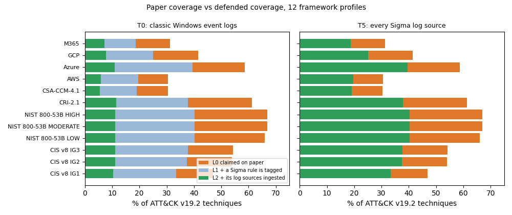
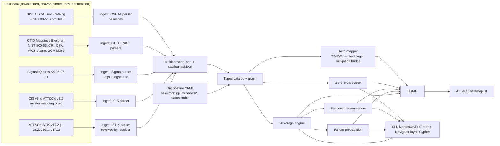

# VANTAGE

[](https://github.com/rakshit-737/vantage/actions/workflows/ci.yml)
[](https://rakshit-737.github.io/vantage/)

[](LICENSE)


**Docs: <https://rakshit-737.github.io/vantage/>** · [static UI demo](https://rakshit-737.github.io/vantage/demo/) · image `ghcr.io/rakshit-737/vantage`

**VANTAGE joins your controls, your detections and MITRE ATT&CK into one graph, then shows the gap between *compliant* and *defensible*.**

**Contribution:** an open, reproducible measurement of how far compliance overstates defensibility. Each ATT&CK technique is scored as the conjunction of an official control mapping (CIS v8, NIST SP 800-53B baselines and six CTID frameworks), a deployed SigmaHQ rule, and that rule's log-source dependencies. Across 12 framework profiles, paper coverage overstates defended coverage by 24-56 pp with classic Windows logs and still by 11-27 pp with every Sigma log source ([ablation](results/ablation.md)).

Organisations pass CIS or NIST audits and still get breached, because "we have a control" does not mean "we can detect the technique it is meant to stop". VANTAGE models the enterprise as a graph (Control → Technique ← Detection ← LogSource) with a segmentation/IAM trust layer. It works out which ATT&CK techniques are actually defended and which are covered only on paper. It runs on **real public data**: the full ATT&CK Enterprise STIX bundle, the **official CIS Controls v8 → ATT&CK mapping**, the **CTID Mappings Explorer** mappings (NIST SP 800-53 rev5 with SP 800-53B baselines, CRI Profile, CSA CCM, AWS, Azure, GCP, M365), and the **SigmaHQ** ruleset (2,877 ATT&CK-tagged rules).

> **Lab-only / defensive.** VANTAGE is a read-only analysis tool that works on a *declared* posture file. It never scans, connects to, or changes any system, and it contains no exploit code. The org profiles are synthetic. The mappings and rules are public.


## Try it in 60 seconds

**Zero install:** open the [static demo](https://rakshit-737.github.io/vantage/demo/). It is the real UI, pre-rendered for the synthetic Acme posture on the real catalog.

**Local, offline:** install from the repo and run the demo on the bundled 33-technique seed catalog (no downloads):

```bash
pip install "git+https://github.com/rakshit-737/vantage"
vantage demo
```

```
== Acme Corp (synthetic) (33 techniques, 30 detections, 13 controls) ==
[1] Compliant but blind: claimed 93.9% vs true 45.5% (16 paper-only techniques, 8 dead rules)
...
```

The `demo` command itself takes about 3 s. CI times the wheel install plus `vantage demo` on every push (job `package`). For the real catalog, see [Quickstart](#quickstart).

## Headline results (real data)

| Result | Number | Source |
|---|---|---|
| Overstatement, paper vs defended, 12 framework profiles | 24.1-55.7 pp (T0 Windows logs), 10.9-26.5 pp (all Sigma log sources) | [ablation](results/ablation.md) |
| CIS IG2 claimed vs defended, classic Windows logs | 53.9% vs 11.2% | [coverage](results/coverage.md) |
| NIST SP 800-53B LOW vs MODERATE paper coverage | 66.0% vs 66.9% of ATT&CK (MODERATE adds 6 techniques) | [cross-framework](results/crossframework.md) |
| Mitigation-bridge auto-mapper vs official CIS mapping | MAP@200 0.417 [0.357, 0.478] (MiniLM), prior 0.161 | [automap](results/automap.md) |
| Bridge minus direct text match, paired, 8 frameworks | TF-IDF +0.017 to +0.238 MAP, MiniLM +0.011 to +0.258 (CI above 0 on 6 of 8 for each) | [cross-framework](results/crossframework.md) |
| Transfer from the 7 other frameworks minus zero-shot, paired | TF-IDF +0.028 to +0.102 MAP (CI above 0 on 6 of 8); MiniLM +0.020 to +0.189 (4 of 8) | [cross-framework](results/crossframework.md) |
| Greedy log-source recommender vs exact ILP | equal at all 7 budgets tested | [recommend](results/recommend.md) |

All numbers come from `benchmarks/*.py` run on ATT&CK v19.2 (697 techniques), CIS v8 (153 safeguards, 2,919 mapped pairs) and SigmaHQ r2026-07-01 (2,877 rules over 116 log sources). The full tables are in [`results/`](results).

**1. Paper and reality diverge by 13-43 percentage points (CIS).** Suppose an org claims every CIS IG2 safeguard and deploys all stable and test Sigma rules. With only classic Windows event logs, its *claimed* coverage is 53.9% but its *defended* coverage is 11.2%. Even with every Sigma log source ingested, it only reaches 37.4%.

| Telemetry tier (CIS IG2 claimed) | log sources | claimed % | detectable % | defended % | gap (pp) |
|---|---:|---:|---:|---:|---:|
| T0 classic Windows event logs | 3 | 53.9 | 13.2 | 11.2 | 42.7 |
| T1 + PowerShell logging | 8 | 53.9 | 22.0 | 16.5 | 37.4 |
| T2 + Sysmon/EDR-class endpoint | 31 | 53.9 | 41.3 | 29.4 | 24.5 |
| T3 + cloud & identity audit | 46 | 53.9 | 46.1 | 32.7 | 21.2 |
| T5 every Sigma log source | 116 | 53.9 | 52.1 | 37.4 | 16.5 |

Weighting each defended technique by rule quality (Sigma level × status, noisy-OR; [ADR 0007](docs/adr/0007-rule-quality-weighting.md)) lowers the defended share by another 2-4 pp (T5: 37.4% → 33.5%). With **NIST SP 800-53 rev5** claims instead (every mapped control, [ADR 0008](docs/adr/0008-nist-800-53.md)), paper coverage rises to 66.9% but defended coverage only to 40.3% at T5, so the gap is wider: 26.6 pp (55.7 pp at T0).

Across 100 random synthetic orgs (25 seeds per level), the mean gap (± one standard deviation across orgs) falls from 33.3 ± 5.2 pp (maturity 0.2; 95% CI of the mean 31.2-35.4) to 20.1 ± 1.5 pp (maturity 0.8; CI 19.4-20.7). Two structural ceilings show up. The official CIS mapping touches only about 54% of current ATT&CK. About 25 pp of the 46 pp shortfall is techniques added after v8.2 (172 of them); the other 21 pp is v8.2-era techniques that CIS never mapped (147). On v8.2 itself CIS covers 72.3%. SigmaHQ's stable and test rules can detect about 52% even with every log source ingested (54.2% with all 2,877 rules).

**1b. The gap is not a CIS artefact, and most of it is telemetry.** The [ablation](results/ablation.md) adds the evidence requirements one at a time for 12 framework profiles. For CIS IG2 at T0, paper coverage is 53.9%. Requiring a tagged Sigma rule cuts it to 37.4%, and requiring that rule's log sources cuts it to 11.2%. NIST SP 800-53B MODERATE goes 66.9% → 40.3% → 11.2%, and AWS goes 30.6% → 19.7% → 5.9%. The bracketed ranges in that table are a one-sided sensitivity check (a random 10% of rules removed), not confidence intervals, so they sit at or below the point estimate.




**2. Auto-mapping controls to ATT&CK, validated against the official CIS mapping.** Each mapper sees only the safeguard's title and description. Scores are macro-averaged over the 105 mapped safeguards (ATT&CK v8.2, labels as published). 95% bootstrap intervals (1,000 resamples of safeguards) are in [`results/automap.md`](results/automap.md); for example MAP@200 is 0.343 [0.281, 0.401] for the TF-IDF bridge vs 0.161 [0.129, 0.196] for the popularity prior, so the gap is well outside the noise. The random row is the mean over 10 seeds.

| Mapper | P@10 | R@20 | R@50 | MAP@200 |
|---|---:|---:|---:|---:|
| random baseline (10-seed mean) | 0.055 | 0.040 | 0.097 | 0.031 |
| popularity prior (leave-one-out) | 0.206 | 0.147 | 0.330 | 0.161 |
| TF-IDF → technique text | 0.162 | 0.162 | 0.271 | 0.120 |
| MiniLM embeddings → technique text | 0.166 | 0.180 | 0.293 | 0.130 |
| **mitigation bridge (TF-IDF)** | 0.311 | 0.347 | 0.550 | 0.343 |
| **mitigation bridge (MiniLM)** | 0.384 | 0.395 | 0.621 | **0.417** |
| mitigation bridge (bge-small) | **0.388** | **0.418** | **0.623** | 0.412 |

Matching control prose directly to adversary-behaviour prose does no better than the popularity prior. Routing through ATT&CK *mitigations* instead (control text → nearest Mxxxx → the techniques it mitigates) gives 2.6× the prior's MAP, with no training and no CIS labels. The MiniLM and bge-small bridges are statistically indistinguishable (overlapping intervals). It is still far from expert level: P@10 = 0.38 against an oracle ceiling of 0.75, since 47 of 105 safeguards have fewer than 10 gold techniques.

**Caveat:** CIS (and CTID for NIST) built their mappings through ATT&CK mitigations. Every CIS gold pair lies inside the techniques of the safeguard's CIS-assigned mitigations, so on CIS the bridge partly recovers CIS's own mitigation assignment. The text step still adds signal: the bridge is well above the popularity prior. On frameworks not built that way (CRI Profile, CSA CCM, AWS, GCP) the bridge still beats direct text matching by a paired +0.05 to +0.24 MAP ([cross-framework](results/crossframework.md)). The bridge idea is prior work; see [Related work](#related-work-automatic-mapping) and [ADR 0005](docs/adr/0005-mitigation-bridge-automapper.md).

**2b. Train on one framework, test on another (round 3).** Each of 8 frameworks (CIS v8, NIST 800-53, CRI Profile v2.1, CSA CCM 4.1, AWS, Azure, GCP, M365) is scored over the ATT&CK release it was mapped against. The pre-specified source pools every *other* framework's labels. It beats the zero-shot bridge on 6 of 8 frameworks with a paired interval above zero (NIST +0.044 [+0.010, +0.075], CSA CCM +0.093 [+0.047, +0.139]). Most *single* sources hurt on the text-rich frameworks: 5-7 of 7 fall below zero-shot. In-framework nested leave-one-out is the ceiling for text-rich frameworks (CIS 0.531, NIST 0.383 MAP@200, TF-IDF). For Azure, though, nested LOO (0.167) is *below* zero-shot (0.186): too few labels to learn from. Full matrix, CIs and the [published-work comparison](results/published.md) are in `results/` ([ADR 0009](docs/adr/0009-cross-framework-transfer.md)). These numbers use the TF-IDF encoder. With MiniLM (run in the `realdata` workflow), pooled transfer helps clearly only on the four sparse-text frameworks (AWS +0.189, GCP +0.119, M365 +0.116, CSA CCM +0.071). On CIS, NIST, CRI and Azure the interval includes zero: a weaker result than TF-IDF.

**3. The greedy recommender matches the exact optimum.** The task is choosing which log sources to onboard under a budget. Starting from the Acme posture (153 techniques already detectable, 99 candidate sources), greedy equalled an exact ILP (scipy/HiGHS) at all seven budgets tested (1, 2, 3, 5, 8, 12, 20); this is an empirical result on this instance, not a guarantee, since greedy budgeted set cover is only approximate in general. It beat "most rules first" by up to 31 techniques and random ordering by 4-17×. Its top pick is `windows/ps_script` (cost 1.15, unlocks 134 rules, +51 techniques), followed by `windows/process_creation` (+101).

**4. Engine speed.** One coverage pass over the full catalog takes about 4 ms. The one-pass single-point-of-failure ranking takes about 10 ms. Brute-force recomputation took 63-283 s, depending on machine load, with identical output.

## What it computes

A technique is **defended** only if (a claimed control mitigates it) AND (a deployed rule detects it) AND (every log source that rule needs is actually ingested).

| Status | Meaning |
| --- | --- |
| `defended` | claimed and detectable |
| `paper_only` | claimed by a control but not detectable ("compliant but blind") |
| `detected_only` | detectable, but no control claims it |
| `blind` | neither |

- **Coverage**: per-technique status, claimed % vs true %, per-tactic tables, and "deployed-but-dead" rules (the rule is deployed but its log source is missing).
- **Failure propagation**: ranks every log source and rule by how many techniques go dark if it fails, and every claimed control by how many techniques lose their only claim (`--kind control`). Each ranking is a single pass and is property-tested against brute force.
- **Recommender**: greedy weighted set cover over "deploy rule" and "onboard log source (plus the rules it unlocks)" actions.
- **Zero-Trust scorer**: a 0-100 score from segmentation (flows weighted by criticality), MFA, PAM, device posture and account hygiene. It also lists the lateral-movement and discovery techniques exposed by open flows into critical segments.
- **Auto-mapper**: TF-IDF, sentence-embedding and mitigation-bridge mappers, plus a cross-framework TransferMapper, with an evaluation harness.
- **Outputs**: FastAPI + web heatmap with what-if toggles, a Markdown/PDF "compliant-but-undetectable" audit report, an ATT&CK Navigator layer, NetworkX JSON, and a Cypher script for Neo4j.

## Architecture



Code layout (`vantage/`): `ingest/` (`attack.py`, `cis.py`, `nist.py`, `ctid.py`, `oscal.py`, `sigma.py`, `build.py`), `download.py`, `frameworks.py`, `transfer.py`, `postures/`, `catalog.py`, `models.py`, `selectors.py`, `coverage.py`, `failure.py`, `recommend.py`, `zerotrust.py`, `automap.py`, `graph.py`, `navigator.py`, `report.py`, `pdf.py`, `api.py`, `web/`, `cli.py`. Offline toy data lives in `seed.py` and `synth.py`.

## Quickstart

```bash
git clone https://github.com/rakshit-737/vantage && cd vantage
pip install -e ".[dev]"                 # core + API + report + test deps
python -m vantage demo                  # offline toy catalog, no downloads

# real data (~180 MB): ATT&CK STIX, CIS v8 + CTID mappings, NIST OSCAL, SigmaHQ
export VANTAGE_DATA_DIR=$PWD/data       # or any folder outside the repo
python -m vantage.download              # resumable, sha256-verified
python -m vantage.ingest.build          # -> $VANTAGE_DATA_DIR/processed/catalog.json

python -m vantage demo      --catalog real
python -m vantage demo      --catalog nist                     # NIST SP 800-53 rev5 claims
python -m vantage coverage  --catalog real --org vantage/postures/acme-real.yaml
python -m vantage failure   --catalog real --top 10
python -m vantage failure   --catalog real --kind control --top 10   # controls that are the only claim
python -m vantage coverage  --catalog nist --org vantage/postures/acme-nist-low.yaml  # SP 800-53B LOW
python -m vantage recommend --catalog real --log-sources-only --steps 5
python -m vantage report    --catalog real --out report.md --pdf report.pdf
python -m vantage navigator --catalog real --out layer.json   # open in ATT&CK Navigator (git-ignored)
python -m vantage automap   --catalog real --method bridge "Require MFA for all remote access"
python -m vantage serve     --catalog real                     # prints http://127.0.0.1:8000/#token=...
```

`make` targets (`make data catalog bench demo-real serve test lint`) wrap the same commands. On Windows without `make`, run the commands directly.

Real-catalog demo output for the synthetic Acme posture, which claims CIS IG2, has deployed all stable and test Sigma rules, but only ships Windows event, cloud, proxy and web logs:

```
== Acme Corp (synthetic, real catalog) (697 techniques, 2877 detections, 153 controls) ==
[1] Compliant but blind: claimed 53.9% vs true 17.6% (253 paper-only techniques, 2132 dead rules)
[2] SPOF: losing log_source 'windows/security' blinds 39 techniques (5.6% of matrix)
[3] Cheapest win: onboard_log_source 'windows/ps_script' (cost 1.15) -> +51 techniques
[4] ZT delta: microsegment finance/servers from general -> score 53.2 -> 61.3, exposed lateral techniques 72 -> 0
```

Generated artefacts are in [`examples/real/`](examples/real): the [audit report](examples/real/acme-real-report.md), its [PDF](examples/real/acme-real-report.pdf) and a [Navigator layer](examples/real/acme-real-navigator-layer.json).

### Posture file

```yaml
name: Acme Corp
claimed_controls: ["@ig2"]                 # or explicit ids: CIS-8.2, CIS-13.3, ... or globs CIS-8.*
ingested_log_sources: [windows/security, "azure/*", proxy]
deployed_detections: ["@status:stable|test&@min-level:medium"]
zero_trust: {segments: [...], open_flows: [[finance, general]], mfa_coverage: 0.6, ...}
```

### API and UI

`python -m vantage serve` binds to 127.0.0.1 and always requires `Authorization: Bearer <token>`. The token is `VANTAGE_API_TOKEN`, or a random one printed at start-up as a `#token=...` link that the UI reads. Requests whose `Host` is not localhost (or listed in `VANTAGE_ALLOWED_HOSTS`) get 400, which defeats DNS rebinding. Bodies are capped at 64 KiB. Endpoints: `GET /api/meta`, `GET|POST /api/coverage` (POST takes what-if toggles), `GET /api/technique/{id}`, `POST /api/failure`, `POST /api/recommend`, `GET /api/zt`, `GET /api/automap`, `GET /api/report`, `GET /api/navigator`. OpenAPI docs are at `/api/docs` when `VANTAGE_API_DOCS=1`. Docker: `VANTAGE_API_TOKEN=<random> VANTAGE_DATA=/path/to/data VANTAGE_CATALOG=real docker compose up --build` (localhost only, read-only FS, non-root).

## Datasets

| Dataset | Version | Size | Licence | Citation |
|---|---|---:|---|---|
| MITRE ATT&CK Enterprise STIX 2.1 | v19.2 and v8.2 | 54 MB + 22 MB | [ATT&CK Terms of Use](https://attack.mitre.org/resources/legal-and-branding/terms-of-use/) | The MITRE Corporation, [attack-stix-data](https://github.com/mitre-attack/attack-stix-data) |
| CIS Controls v8 Master Mapping to MITRE Enterprise ATT&CK v8.2 | 2021 | 1.2 MB | CC BY-NC-ND 4.0 | Center for Internet Security, [white paper](https://www.cisecurity.org/insights/white-papers/cis-controls-v8-master-mapping-to-mitre-enterprise-attck-v82) |
| NIST SP 800-53 rev5 → ATT&CK v16.1 (CTID Mappings Explorer) | 2025-04-16 | 2.0 MB | Apache-2.0 | Center for Threat-Informed Defense, [mappings-explorer](https://github.com/center-for-threat-informed-defense/mappings-explorer) |
| ATT&CK Enterprise STIX 2.1 (releases the CTID mappings target) | v16.1, v17.1 | 46 MB + 45 MB | [ATT&CK Terms of Use](https://attack.mitre.org/resources/legal-and-branding/terms-of-use/) | The MITRE Corporation, [attack-stix-data](https://github.com/mitre-attack/attack-stix-data) |
| CTID Mappings Explorer: AWS, Azure, GCP, M365 security stack; CRI Profile v2.1; CSA CCM 4.1 to ATT&CK | 12.12.2024 / 04.26.2025 / 03.06.2025 / 07.18.2025 / v2.1 / 4.1 (ATT&CK 16.1; CSA 17.1) | 0.5-1.5 MB each | Apache-2.0 | Center for Threat-Informed Defense, [mappings-explorer](https://github.com/center-for-threat-informed-defense/mappings-explorer) |
| NIST SP 800-53 rev5 OSCAL catalog + SP 800-53B LOW/MODERATE/HIGH/PRIVACY profiles | oscal-content @78650f0 | 10 MB + 4 small | Public domain (US Government work) | NIST, [oscal-content](https://github.com/usnistgov/oscal-content) |
| SigmaHQ rule release (`sigma_all_rules.zip`) | r2026-07-01 | 3.2 MB | [DRL 1.1](https://github.com/SigmaHQ/Detection-Rule-License) | SigmaHQ, [sigma](https://github.com/SigmaHQ/sigma) |

None of these files are committed. `python -m vantage.download` (also `scripts/download_data.py`) fetches them from URLs pinned to upstream commits with pinned sha256 digests. The CIS workbook is non-commercial / no-derivatives: it is read locally, and only ids and aggregate metrics are published. Sigma rules keep their authors' attribution in the upstream files.

## Reproducibility

Exact commands, expected outputs and measured runtimes are on the [Reproduce](https://rakshit-737.github.io/vantage/reproduce/) page. In short:

```bash
python -m vantage.download && python -m vantage.ingest.build
cd benchmarks && for b in coverage automap recommend crossframework ablation published; do python bench_$b.py; done
python -m pytest -q                     # realdata tests skip without the catalog
git diff --exit-code ../results/*.md    # determinism check (timing columns aside)
```

Results were produced on Windows 11, Python 3.14, CPU only. Everything is seeded; only timings vary. The `realdata` workflow re-runs the pipeline weekly on GitHub Actions and fails on any sha256 mismatch.

## Prior art and how this differs

| Existing | What it does | What VANTAGE adds |
| --- | --- | --- |
| [DeTT&CT (Rabobank CDC)](https://github.com/rabobank-cdc/DeTTECT) | Scores data-source and detection coverage against ATT&CK | A control-framework layer, "paper vs real" status, failure propagation, recommender, Zero-Trust score |
| [ATT&CK Navigator](https://mitre-attack.github.io/attack-navigator/) | Manual technique heatmap | Computed status and what-ifs. VANTAGE exports Navigator layers. |
| [CTID Mappings Explorer](https://center-for-threat-informed-defense.github.io/mappings-explorer/) | Curated control → ATT&CK mappings | Consumes such mappings and joins them with live detection state |
| Sigma coverage tools (e.g. `sigma-cli` analyze) | Rule → technique coverage | Log-source dependency, dead-rule detection, control claims |
| Commercial GRC (Vanta, Drata, scorecards) | Evidence collection, external ratings | Technique- and detection-level linkage, open and local |

**Honest scope:** ATT&CK mapping, Sigma and the frameworks themselves are not novel, and DeTT&CT already covers the data-source → ATT&CK part. The contribution is joining Control → Detection → LogSource → Technique on the official public mappings, measuring the paper-vs-real gap across 12 framework profiles, and running failure and set-cover reasoning on top.

### Related work: automatic mapping

- Lee, Yoon, Lee and Kang, *Enhancing RMF and ATT&CK Mapping Accuracy Through Integration of Sentence-BERT and Mitigation Parameters*, Electronics 15(6):1248, 2026, [doi:10.3390/electronics15061248](https://doi.org/10.3390/electronics15061248). This paper uses ATT&CK mitigations as the bridge between controls and techniques, evaluated against the CTID NIST mapping. VANTAGE's mitigation bridge is an independent re-implementation of that idea, here evaluated on CIS v8 and 7 other frameworks. **No directly comparable benchmark exists**: their Recall@restricted metric is defined only in the full text, which we could not retrieve. See [results/published.md](results/published.md) for every setup difference.
- Lee et al., BERT models for RMF to ATT&CK mapping, Journal of Information and Security 25(5), 2025, [doi:10.33778/kcsa.2025.25.5.011](https://doi.org/10.33778/kcsa.2025.25.5.011).
- Rahman and Williams, NIST SP 800-53 vs ATT&CK coverage analysis, [arXiv:2211.06500](https://arxiv.org/abs/2211.06500).
- Orbinato et al., automatic mapping of unstructured CTI to ATT&CK, ISSRE 2022, [arXiv:2208.12144](https://arxiv.org/abs/2208.12144). CTID [TRAM](https://github.com/center-for-threat-informed-defense/tram) classifies CTI sentences into about 50 techniques. That is a different task, and its published scores come from a private dataset.

## Limitations

- **"Detectable" means a live rule is tagged with the technique.** A Sigma tag is not proof of detection quality: rules differ in precision and recall and in how much of a technique's procedure space they cover. The rule-quality weighted score uses assumed weights, not measured precision/recall. Sub-techniques and parent techniques are scored separately.
- **The CIS mapping is from 2021 (ATT&CK v8.2).** 134 ids were carried forward via revoked-by and 14 deprecated ids were dropped. Techniques added since then cannot be "claimed" through CIS.
- **Costs are assumptions** (ADR 0004), not measurements. The Zero-Trust facts and all org profiles are synthetic; no public dataset of enterprise postures exists.
- **Auto-mapping is a suggestion tool.** The mitigation bridge benefits from CIS and CTID having built their mappings via ATT&CK mitigations; on the other frameworks it scores lower (MAP@200 0.09-0.36, TF-IDF).
- There is no live telemetry ingestion: "ingested" is declared in the posture file, not measured.
- NIST SP 800-53B baselines come from the NIST OSCAL profiles. LOW already reaches 460 of the 466 CTID-mapped techniques, so "claim every mapped control" is barely an upper bound. ISO 27001 and NIST CSF have no official ATT&CK mapping and are not included; two-hop mappings derived through 800-53 would over-approximate.
- Spec deviations: the UI is vanilla JS rather than React (ADR 0006), and there is no LLM re-ranker, so everything runs offline without an API key. The asset/identity layer is segment-level only.
- The static Pages demo cannot run what-ifs or auto-mapping; those need the local API.

## Roadmap

- [x] Real ATT&CK / CIS / Sigma ingest with revoked-id resolution
- [x] Coverage, failure propagation, recommender, Zero-Trust score on the real catalog
- [x] Auto-mapper benchmark against the official CIS mapping
- [x] FastAPI + heatmap UI, PDF audit report, Navigator export, Docker
- [x] NIST 800-53 rev5 → ATT&CK (CTID Mappings Explorer) as a second control framework (v1.0.0)
- [x] Rule-quality weighting (Sigma level/status) in the defended score (v1.0.0)
- [x] Docs site, static UI demo, container image on GHCR, tagged releases (v1.0.0)
- [x] NIST SP 800-53B baselines as selectors; CRI, CSA CCM, AWS, Azure, GCP, M365 mappings; cross-framework transfer evaluation (round 3)
- [x] Control-failure SPOFs; Neo4j round-trip check in CI
- [ ] Sigma false-positive notes in rule quality (free text: needs human labelling)
- [ ] Asset/identity graph beyond segment-level facts; live Neo4j sync (needs a running Neo4j and real asset data)
- [ ] Posture ingestion from SIEM APIs (log-source health) instead of declarations (needs a live SIEM)

## Safety

See [SECURITY.md](SECURITY.md) and [THREAT_MODEL.md](THREAT_MODEL.md). A real posture file and its reports are a roadmap of your blind spots. Keep them local, treat them as confidential, and never expose the API on a public interface.

## Licence

MIT (see [LICENSE](LICENSE)) for the code. Third-party datasets keep their own licences (see [Datasets](#datasets)).
