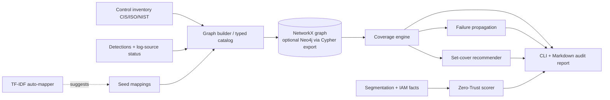

# VANTAGE

**A control → detection → ATT&CK coverage graph and Zero-Trust posture engine.** It shows the gap between *compliant* and *defensible*.

Organisations pass ISO 27001 / CIS audits and still get breached, because "we have a control" does not mean "we can detect the technique it is meant to stop". VANTAGE models the enterprise as a tri-partite graph (Control → Technique ← Detection ← LogSource) plus a segmentation/IAM trust layer. It then works out which ATT&CK techniques are actually defended and which are covered only on paper.

> **Lab-only / defensive.** VANTAGE is a read-only analysis tool that runs over a *declared* posture file. It never scans, connects to, or changes any system. All bundled data is synthetic. It contains no exploit code.

## What it computes

A technique is **defended** only if (a claimed control mitigates it) AND (a deployed detection covers it) AND (every log source that detection needs is actually ingested).

| Status | Meaning |
| --- | --- |
| `defended` | claimed and detectable |
| `paper_only` | claimed by a control but not detectable ("compliant but blind") |
| `detected_only` | detectable, but no control claims it |
| `blind` | neither |

Engines:
- **Coverage**: per-technique status, claimed % vs true %, and "deployed-but-dead" rules (the rule is deployed but its log source is missing).
- **Failure propagation**: removes one log source or rule, recomputes, and ranks single points of failure.
- **Recommender**: greedy weighted set cover over "deploy rule" and "onboard log source (plus the rules it unlocks)" actions. It optimises new techniques per unit of cost.
- **Zero-Trust scorer**: a 0–100 rule-based score from segmentation (flows weighted by criticality), MFA, PAM, device posture, and account hygiene. It also lists the lateral-movement techniques exposed by open flows into critical segments.
- **Auto-mapper**: free-text control → ATT&CK using dependency-free TF-IDF + cosine, with precision/recall@k against the seed labels.
- **Reports and exports**: Markdown "compliant-but-undetectable" audit report, a text ATT&CK heatmap, NetworkX JSON, and a Cypher script for an optional Neo4j.

## Architecture



Code layout (`vantage/`): `models.py` (typed contracts and validators), `seed.py` (catalog), `coverage.py`, `failure.py`, `recommend.py`, `zerotrust.py`, `automap.py`, `graph.py`, `io.py` (YAML), `synth.py` (synthetic orgs), `report.py`, `cli.py`.

## Quickstart

```bash
pip install -e ".[dev]"      # deps: networkx, PyYAML (pytest for tests)
make demo                    # runs the five demo scenarios on the synthetic "Acme Corp"
make test
python -m vantage coverage                     # summary + heatmap
python -m vantage failure --top 5              # SPOF ranking
python -m vantage recommend --budget 5
python -m vantage zt
python -m vantage report --out report.md
python -m vantage automap "require MFA for VPN access"
python -m vantage synth --seed 7 --maturity 0.6 --out my-org.yaml
python -m vantage coverage --org my-org.yaml
python -m vantage graph --format cypher > graph.cypher   # optional Neo4j (docker compose up)
```

`make demo` output on the bundled synthetic org:

```
[1] Compliant but blind: claimed 93.9% vs true 45.5% (16 paper-only techniques, 8 dead rules)
[2] SPOF: losing EDR telemetry blinds 9 techniques (27.3% of matrix)
[3] Cheapest win: onboard_log_source 'win_security' (cost 1) -> +8 techniques
[4] ZT delta: microsegment finance/servers from general -> score 53.2 -> 61.3, exposed lateral techniques 7 -> 0
[+] Auto-map (TF-IDF) vs seed labels @k=5: P=0.623 R=0.868
```

See `examples/acme.yaml` for the posture-file format and `examples/acme-report.md` for a generated report.

## Prior art & how this differs

| Existing | What it does | What VANTAGE adds |
| --- | --- | --- |
| MITRE DeTT&CT | Scores data-source/detection coverage against ATT&CK | A control-framework layer, "paper vs real" status, and a Zero-Trust score |
| ATT&CK Navigator | Manual technique heatmap | Computed status, failure what-ifs, and recommendations |
| Commercial GRC (Vanta, Drata, scorecards) | Evidence collection and external ratings | Linkage at the technique and detection level |

**Honest scope:** ATT&CK mapping, Sigma, and the frameworks themselves are not novel, and DeTT&CT already covers the data-source → ATT&CK part. What this project contributes is joining Control → Detection → LogSource → Technique in one queryable model, plus failure propagation and set-cover reasoning on top of it.

## Status and TODO (not built in this MVP)

- **Grade D:** curate real CIS v8 / ISO 27001 / NIST CSF → ATT&CK mappings. The seed mappings in `seed.py` are **illustrative**, hand-written, and not authoritative. The auto-mapper's precision/recall is measured against these same labels, so treat it as a smoke test and not as expert accuracy.
- **Grade C:** ingest the full ATT&CK STIX bundle and the SigmaHQ ruleset (parse `tags: attack.tXXXX` and `logsource`). Add a sentence-transformers backend for the auto-mapper.
- **Grade B:** a FastAPI layer, a React ATT&CK-matrix UI, a live Neo4j backend (currently it only exports Cypher), and PDF export of the audit report.
- Asset/identity graph beyond segment-level facts.

## Safety

See [SECURITY.md](SECURITY.md) and [THREAT_MODEL.md](THREAT_MODEL.md). A real posture file and its reports are a roadmap of your blind spots. Keep them local and treat them as confidential.
