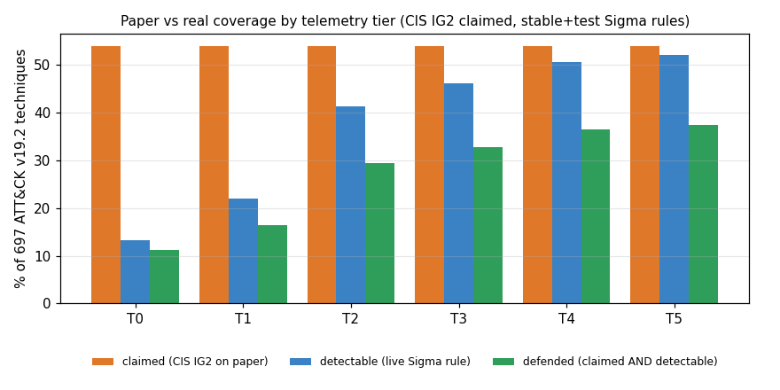

# VANTAGE

[](https://github.com/rakshit-737/vantage/actions/workflows/ci.yml)

[](LICENSE)


**VANTAGE joins your controls, your detections and MITRE ATT&CK into one graph, then shows the gap between *compliant* and *defensible*.**

Organisations pass CIS or ISO audits and still get breached, because "we have a control" does not mean "we can detect the technique it is meant to stop". VANTAGE models the enterprise as a graph (Control → Technique ← Detection ← LogSource) with a segmentation/IAM trust layer. It works out which ATT&CK techniques are actually defended and which are covered only on paper. It runs on **real public data**: the full ATT&CK Enterprise STIX bundle, the **official CIS Controls v8 → ATT&CK mapping**, and the **SigmaHQ** ruleset (2,877 ATT&CK-tagged rules).

> **Lab-only / defensive.** VANTAGE is a read-only analysis tool that works on a *declared* posture file. It never scans, connects to, or changes any system, and it contains no exploit code. The org profiles are synthetic. The mappings and rules are public.


## Headline results (real data)

All numbers come from `benchmarks/*.py` run on ATT&CK v19.2 (697 techniques), CIS v8 (153 safeguards, 2,919 mapped pairs) and SigmaHQ r2026-07-01 (2,877 rules over 116 log sources). The full tables are in [`results/`](results).

**1. Paper and reality diverge by 13-43 percentage points.** Suppose an org claims every CIS IG2 safeguard and deploys all stable and test Sigma rules. With only classic Windows event logs, its *claimed* coverage is 53.9% but its *defended* coverage is 11.2%. Even with every Sigma log source ingested, it only reaches 37.4%.

| Telemetry tier (CIS IG2 claimed) | log sources | claimed % | detectable % | defended % | gap (pp) |
|---|---:|---:|---:|---:|---:|
| T0 classic Windows event logs | 3 | 53.9 | 13.2 | 11.2 | 42.7 |
| T1 + PowerShell logging | 8 | 53.9 | 22.0 | 16.5 | 37.4 |
| T2 + Sysmon/EDR-class endpoint | 31 | 53.9 | 41.3 | 29.4 | 24.5 |
| T3 + cloud & identity audit | 46 | 53.9 | 46.1 | 32.7 | 21.2 |
| T5 every Sigma log source | 116 | 53.9 | 52.1 | 37.4 | 16.5 |

Across 100 random synthetic orgs, the mean gap falls from 33.3 ± 5.2 pp (maturity 0.2) to 20.1 ± 1.5 pp (maturity 0.8). Two structural ceilings show up. The official CIS mapping touches only about 54% of current ATT&CK, because it was authored against v8.2. SigmaHQ can detect about 52% even with every log source ingested.



**2. Auto-mapping controls to ATT&CK, validated against the official CIS mapping.** Each mapper sees only the safeguard's title and description. Scores are macro-averaged over the 105 mapped safeguards (ATT&CK v8.2, labels as published).

| Mapper | P@10 | R@20 | R@50 | MAP@200 |
|---|---:|---:|---:|---:|
| random baseline | 0.062 | 0.045 | 0.096 | 0.033 |
| popularity prior (leave-one-out) | 0.206 | 0.147 | 0.330 | 0.161 |
| TF-IDF → technique text | 0.162 | 0.162 | 0.271 | 0.120 |
| MiniLM embeddings → technique text | 0.166 | 0.180 | 0.293 | 0.130 |
| **mitigation bridge (TF-IDF)** | 0.311 | 0.347 | 0.550 | 0.343 |
| **mitigation bridge (MiniLM)** | **0.384** | 0.395 | 0.621 | **0.417** |
| mitigation bridge (bge-small) | 0.388 | **0.418** | **0.623** | 0.412 |

Matching control prose directly to adversary-behaviour prose does no better than the popularity prior. Routing through ATT&CK *mitigations* instead (control text → nearest Mxxxx → the techniques it mitigates) gives 2.6× the prior's MAP, with no training and no CIS labels. That is useful, but it is still far from expert level (P@10 = 0.38). See [ADR 0005](docs/adr/0005-mitigation-bridge-automapper.md) for caveats.

**3. The greedy recommender matches the exact optimum.** The task is choosing which log sources to onboard under a budget. Starting from the Acme posture (153 techniques already detectable, 99 candidate sources), greedy equalled an exact ILP (scipy/HiGHS) at all seven budgets tested (1, 2, 3, 5, 8, 12, 20); this is an empirical result on this instance, not a guarantee, since greedy budgeted set cover is only approximate in general. It beat "most rules first" by up to 31 techniques and random ordering by 4-17×. Its top pick is `windows/ps_script` (cost 1.15, unlocks 134 rules, +51 techniques), followed by `windows/process_creation` (+101).

**4. Engine speed.** One coverage pass over the full catalog takes 5 ms. The one-pass single-point-of-failure ranking takes 4 ms, against 63 s for brute-force recomputation, with identical output.

## What it computes

A technique is **defended** only if (a claimed control mitigates it) AND (a deployed rule detects it) AND (every log source that rule needs is actually ingested).

| Status | Meaning |
| --- | --- |
| `defended` | claimed and detectable |
| `paper_only` | claimed by a control but not detectable ("compliant but blind") |
| `detected_only` | detectable, but no control claims it |
| `blind` | neither |

- **Coverage**: per-technique status, claimed % vs true %, per-tactic tables, and "deployed-but-dead" rules (the rule is deployed but its log source is missing).
- **Failure propagation**: ranks every log source and rule by how many techniques go dark if it fails, in one pass.
- **Recommender**: greedy weighted set cover over "deploy rule" and "onboard log source (plus the rules it unlocks)" actions.
- **Zero-Trust scorer**: a 0-100 score from segmentation (flows weighted by criticality), MFA, PAM, device posture and account hygiene. It also lists the lateral-movement and discovery techniques exposed by open flows into critical segments.
- **Auto-mapper**: TF-IDF, sentence-embedding and mitigation-bridge mappers, with an evaluation harness.
- **Outputs**: FastAPI + web heatmap with what-if toggles, a Markdown/PDF "compliant-but-undetectable" audit report, an ATT&CK Navigator layer, NetworkX JSON, and a Cypher script for Neo4j.

## Architecture

```mermaid
flowchart LR
  subgraph Public data - downloaded, sha256-pinned, never committed
    A[ATT&CK STIX v19.2 + v8.2]
    C[CIS v8 -> ATT&CK v8.2 master mapping xlsx]
    S[SigmaHQ rules r2026-07-01]
  end
  A --> I[ingest: STIX parser<br/>revoked-by resolver]
  C --> I2[ingest: CIS parser]
  S --> I3[ingest: Sigma parser<br/>tags + logsource]
  I & I2 & I3 --> B[build: catalog.json]
  O[Org posture YAML<br/>selectors: @ig2, windows/*, @status:stable] --> E
  B --> E[Typed catalog + graph]
  E --> CE[Coverage engine]
  CE --> FP[Failure propagation]
  CE --> RC[Set-cover recommender]
  E --> ZT[Zero-Trust scorer]
  E --> AM[Auto-mapper<br/>TF-IDF / embeddings / mitigation bridge]
  CE & FP & RC & ZT & AM --> API[FastAPI]
  API --> UI[ATT&CK heatmap UI]
  CE & FP & RC & ZT --> R[CLI · Markdown/PDF report · Navigator layer · Cypher]
```

Code layout (`vantage/`): `ingest/` (`attack.py`, `cis.py`, `sigma.py`, `build.py`), `catalog.py`, `models.py`, `selectors.py`, `coverage.py`, `failure.py`, `recommend.py`, `zerotrust.py`, `automap.py`, `graph.py`, `navigator.py`, `report.py`, `pdf.py`, `api.py`, `web/`, `cli.py`. Offline toy data lives in `seed.py` and `synth.py`.

## Quickstart

```bash
pip install -e ".[dev]"                 # core + API + report + test deps
python -m vantage demo                  # offline toy catalog, no downloads

# real data (~80 MB): ATT&CK STIX, CIS v8 mapping, SigmaHQ
export VANTAGE_DATA_DIR=$PWD/data       # or any folder outside the repo
python scripts/download_data.py         # resumable, sha256-verified
python -m vantage.ingest.build          # -> $VANTAGE_DATA_DIR/processed/catalog.json

python -m vantage demo      --catalog real
python -m vantage coverage  --catalog real --org examples/real/acme-real.yaml
python -m vantage failure   --catalog real --top 10
python -m vantage recommend --catalog real --log-sources-only --steps 5
python -m vantage report    --catalog real --out report.md --pdf report.pdf
python -m vantage navigator --catalog real --out layer.json   # open in ATT&CK Navigator
python -m vantage automap   --catalog real --method bridge "Require MFA for all remote access"
python -m vantage serve     --catalog real                     # http://127.0.0.1:8000
```

`make` targets (`make data catalog bench demo-real serve test lint`) wrap the same commands. On Windows without `make`, run the commands directly.

Real-catalog demo output for the synthetic Acme posture, which claims CIS IG2, has deployed all stable and test Sigma rules, but only ships Windows event, cloud, proxy and web logs:

```
== Acme Corp (synthetic, real catalog) (697 techniques, 2877 detections, 153 controls) ==
[1] Compliant but blind: claimed 53.9% vs true 17.6% (253 paper-only techniques, 2132 dead rules)
[2] SPOF: losing log_source 'windows/security' blinds 39 techniques (5.6% of matrix)
[3] Cheapest win: onboard_log_source 'windows/ps_script' (cost 1.15) -> +51 techniques
[4] ZT delta: microsegment finance/servers from general -> score 53.2 -> 61.3, exposed lateral techniques 72 -> 0
```

Generated artefacts are in [`examples/real/`](examples/real): the [audit report](examples/real/acme-real-report.md), its [PDF](examples/real/acme-real-report.pdf) and a [Navigator layer](examples/real/acme-real-navigator-layer.json).

### Posture file

```yaml
name: Acme Corp
claimed_controls: ["@ig2"]                 # or explicit ids: CIS-8.2, CIS-13.3, ... or globs CIS-8.*
ingested_log_sources: [windows/security, "azure/*", proxy]
deployed_detections: ["@status:stable|test&@min-level:medium"]
zero_trust: {segments: [...], open_flows: [[finance, general]], mfa_coverage: 0.6, ...}
```

### API and UI

`python -m vantage serve` binds to 127.0.0.1. Set `VANTAGE_API_TOKEN` to require `Authorization: Bearer <token>`; the UI reads the token from `#token=...` in the URL. Endpoints: `GET /api/meta`, `GET|POST /api/coverage` (POST takes what-if toggles), `GET /api/technique/{id}`, `POST /api/failure`, `POST /api/recommend`, `GET /api/zt`, `GET /api/automap`, `GET /api/report`, `GET /api/navigator`. OpenAPI docs are at `/api/docs`. Docker: `VANTAGE_DATA=/path/to/data VANTAGE_CATALOG=real docker compose up --build` (localhost only, read-only FS, non-root).

## Datasets

| Dataset | Version | Size | Licence | Citation |
|---|---|---:|---|---|
| MITRE ATT&CK Enterprise STIX 2.1 | v19.2 and v8.2 | 54 MB + 22 MB | [ATT&CK Terms of Use](https://attack.mitre.org/resources/legal-and-branding/terms-of-use/) | The MITRE Corporation, [attack-stix-data](https://github.com/mitre-attack/attack-stix-data) |
| CIS Controls v8 Master Mapping to MITRE Enterprise ATT&CK v8.2 | 2021 | 1.2 MB | CC BY-NC-ND 4.0 | Center for Internet Security, [white paper](https://www.cisecurity.org/insights/white-papers/cis-controls-v8-master-mapping-to-mitre-enterprise-attck-v82) |
| SigmaHQ rule release (`sigma_all_rules.zip`) | r2026-07-01 | 3.2 MB | [DRL 1.1](https://github.com/SigmaHQ/Detection-Rule-License) | SigmaHQ, [sigma](https://github.com/SigmaHQ/sigma) |

None of these files are committed. `scripts/download_data.py` fetches them with pinned sha256 digests. The CIS workbook is non-commercial / no-derivatives: it is read locally, and only ids and aggregate metrics are published. Sigma rules keep their authors' attribution in the upstream files.

## Reproducibility

```bash
python scripts/download_data.py && python -m vantage.ingest.build
python benchmarks/bench_automap.py      # ~2 min on CPU (embeddings); --no-embed for TF-IDF only
python benchmarks/bench_coverage.py     # ~1 min (includes the 63 s brute-force SPOF check)
python benchmarks/bench_recommend.py    # ~20 s (needs scipy for the ILP)
python -m pytest -q                     # 83 tests; 3 realdata tests skip without the catalog
```

Results were produced on Windows 11, Python 3.14, CPU only. Everything is deterministic except embedding timing.

## Prior art and how this differs

| Existing | What it does | What VANTAGE adds |
| --- | --- | --- |
| [MITRE DeTT&CT](https://github.com/rabobank-cdc/DeTTECT) | Scores data-source and detection coverage against ATT&CK | A control-framework layer, "paper vs real" status, failure propagation, recommender, Zero-Trust score |
| [ATT&CK Navigator](https://mitre-attack.github.io/attack-navigator/) | Manual technique heatmap | Computed status and what-ifs. VANTAGE exports Navigator layers. |
| [CTID Mappings Explorer](https://center-for-threat-informed-defense.github.io/mappings-explorer/) | Curated control → ATT&CK mappings | Consumes such mappings and joins them with live detection state |
| Sigma coverage tools (e.g. `sigma-cli` analyze) | Rule → technique coverage | Log-source dependency, dead-rule detection, control claims |
| Commercial GRC (Vanta, Drata, scorecards) | Evidence collection, external ratings | Technique- and detection-level linkage, open and local |

**Honest scope:** ATT&CK mapping, Sigma and the frameworks themselves are not novel, and DeTT&CT already covers the data-source → ATT&CK part. The contribution is joining Control → Detection → LogSource → Technique on the official public mappings, measuring the paper-vs-real gap, and running failure and set-cover reasoning on top.

## Limitations

- **"Detectable" means a live rule is tagged with the technique.** A Sigma tag is not proof of detection quality: rules differ in precision and recall and in how much of a technique's procedure space they cover. Sub-techniques and parent techniques are scored separately.
- **The CIS mapping is from 2021 (ATT&CK v8.2).** 134 ids were carried forward via revoked-by and 14 deprecated ids were dropped. Techniques added since then cannot be "claimed" through CIS.
- **Costs are assumptions** (ADR 0004), not measurements. The Zero-Trust facts and all org profiles are synthetic; no public dataset of enterprise postures exists.
- **Auto-mapping is a suggestion tool.** The mitigation bridge benefits from CIS having built its mapping via ATT&CK mitigations, so results on other frameworks may be lower.
- There is no live telemetry ingestion: "ingested" is declared in the posture file, not measured.

## Roadmap

- [x] Real ATT&CK / CIS / Sigma ingest with revoked-id resolution
- [x] Coverage, failure propagation, recommender, Zero-Trust score on the real catalog
- [x] Auto-mapper benchmark against the official CIS mapping
- [x] FastAPI + heatmap UI, PDF audit report, Navigator export, Docker
- [ ] NIST 800-53 → ATT&CK (CTID Mappings Explorer) as a second control framework
- [ ] Rule-quality weighting (Sigma level/status, false-positive notes) in the defended score
- [ ] Asset/identity graph beyond segment-level facts; live Neo4j sync
- [ ] Posture ingestion from SIEM APIs (log-source health) instead of declarations

## Safety

See [SECURITY.md](SECURITY.md) and [THREAT_MODEL.md](THREAT_MODEL.md). A real posture file and its reports are a roadmap of your blind spots. Keep them local, treat them as confidential, and never expose the API on a public interface.

## Licence

MIT (see [LICENSE](LICENSE)) for the code. Third-party datasets keep their own licences (see [Datasets](#datasets)).
