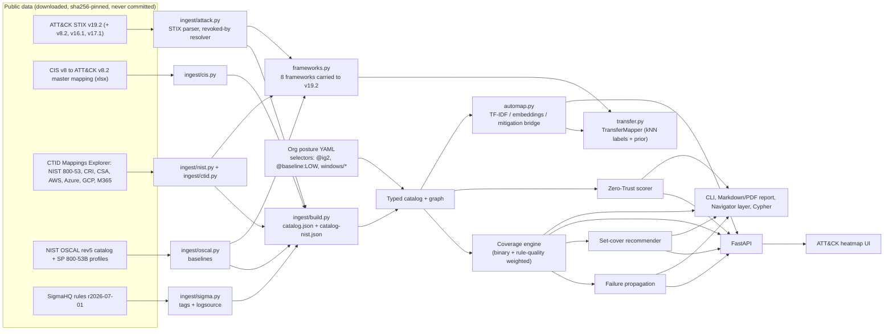

# Architecture

`frameworks.py` and `transfer.py` feed the cross-framework evaluation
(`benchmarks/bench_crossframework.py`, [ADR 0009](adr/0009-cross-framework-transfer.md)); the
coverage engine itself reads the built catalogs.

## The rule

A technique is **defended** only if (a claimed control mitigates it) AND (a deployed rule
detects it) AND (every log source that rule needs is actually ingested).

| Status | Meaning |
| --- | --- |
| `defended` | claimed and detectable |
| `paper_only` | claimed by a control but not detectable ("compliant but blind") |
| `detected_only` | detectable, but no control claims it |
| `blind` | neither |

"Defended" is detection-backed coverage. A technique claimed only by a preventive control can
still be blocked without any detection; see [Evaluation](evaluation.md#methodology).

`weighted_true_pct` additionally scores each defended technique by a noisy-OR of its live rules'
quality (Sigma level x status), see [ADR 0007](adr/0007-rule-quality-weighting.md).

## Engines

- **Coverage** (`vantage.coverage`): per-technique status, claimed % vs true %, per-tactic tables,
  deployed-but-dead rules.
- **Failure propagation** (`vantage.failure`): ranks every log source and rule by how many
  techniques go dark if it fails, and every claimed control by how many techniques lose their
  only claim, each in one pass (identical output to brute-force recomputation).
- **Recommender** (`vantage.recommend`): greedy weighted set cover over "deploy rule" and
  "onboard log source (plus the rules it unlocks)" actions, checked against an exact ILP. It
  maximises newly *detectable* techniques.
- **Zero-Trust scorer** (`vantage.zerotrust`): 0-100 from segmentation, MFA, PAM, device posture
  and account hygiene, plus the lateral-movement techniques exposed by open flows.
- **Auto-mapper** (`vantage.automap`): control text to techniques, directly or through ATT&CK
  mitigations ([ADR 0005](adr/0005-mitigation-bridge-automapper.md)).
- **Cross-framework transfer** (`vantage.frameworks`, `vantage.transfer`): every framework as
  `Control` objects on one ATT&CK release; the TransferMapper adds labels learned from other
  frameworks to the mitigation bridge.

## Code layout

`vantage/ingest/` (`attack.py`, `cis.py`, `nist.py`, `ctid.py`, `oscal.py`, `sigma.py`,
`build.py`), `download.py`, `paths.py`, `frameworks.py`, `transfer.py`, `postures/`,
`catalog.py`, `models.py`, `io.py`, `selectors.py`, `coverage.py`, `failure.py`, `recommend.py`,
`zerotrust.py`, `automap.py`, `graph.py`, `navigator.py`, `report.py`, `pdf.py`, `api.py`,
`web/`, `cli.py`. Offline toy data lives in `seed.py` and `synth.py`.
