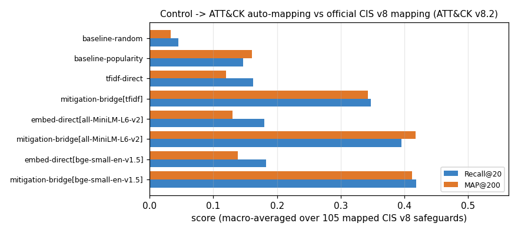
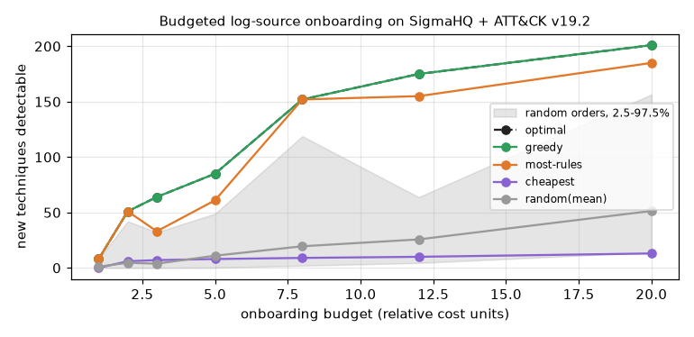

# Benchmarks & results

All numbers come from `benchmarks/*.py` on ATT&CK v19.2 (697 techniques), CIS v8 (153
safeguards), NIST SP 800-53 rev5 (109 mapped controls) and SigmaHQ r2026-07-01 (2,877 rules over
116 log sources). The tables below are included verbatim from `results/*.md`, which the scripts
regenerate.

```bash
python scripts/download_data.py && python -m vantage.ingest.build
python benchmarks/bench_coverage.py     # a few minutes (includes the brute-force SPOF check)
python benchmarks/bench_automap.py      # ~3 min on CPU with embeddings; --no-embed for TF-IDF only
python benchmarks/bench_recommend.py    # ~30 s (needs scipy for the ILP)
```

Randomness is seeded everywhere (synthetic orgs: seeds 0-24 per maturity level; random mapping
baseline: 10 seeds; bootstrap: 1,000 resamples, seed 0). Only timings vary between runs, and
they depend on machine load.

## 1. Paper vs real coverage


--8<-- "results/coverage.md"

## 2. Auto-mapping controls to ATT&CK

Each mapper sees only the safeguard's title and description. Ground truth is the official CIS v8
-> ATT&CK v8.2 mapping (105 mapped safeguards).



--8<-- "results/automap.md"

## 3. Recommender vs exact optimum



--8<-- "results/recommend.md"
