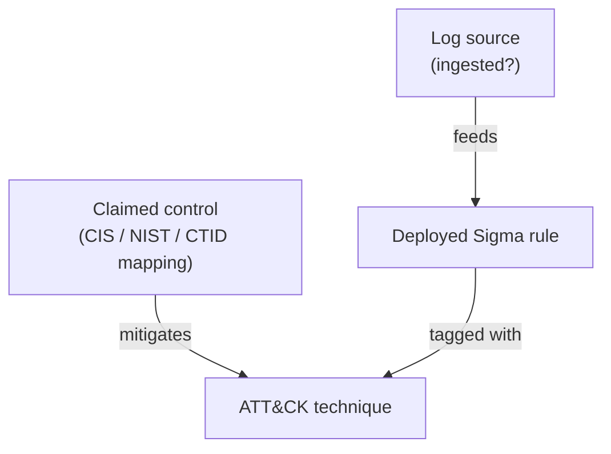

# How it works

VANTAGE answers one question per ATT&CK technique: **is it defended, or only claimed?** This page
follows two real techniques through the pipeline, using the synthetic Acme posture
(`vantage/postures/acme-real.yaml`) on the real catalog: ATT&CK v19.2, the official CIS v8 mapping
and SigmaHQ r2026-07-01. Acme claims CIS IG2, deploys every stable and test Sigma rule, and ingests
only Windows event, cloud, proxy and web logs.

A technique is **defended** only when all three hold: a claimed control maps to it, a deployed rule
is tagged with it, and every log source that rule reads is ingested. Otherwise it is
`paper_only` (claimed, not detectable), `detected_only` or `blind`.

## Step 1: the claim

The posture says `claimed_controls: ["@ig2"]`. The official CIS workbook maps 7 IG2 safeguards to
**T1055 Process Injection** and 14 to **T1003.001 LSASS Memory**. On paper both are covered, and a
compliance dashboard would colour both green.

## Step 2: the rules

SigmaHQ has rules tagged with both techniques, and Acme deploys all stable and test ones. A
"coverage by ATT&CK tag" view (DeTT&CT-style, ignoring telemetry) would also call both covered.

## Step 3: the telemetry

Each Sigma rule declares a `logsource` (product/category/service), which VANTAGE turns into a
dependency such as `windows/process_creation`. Acme does not ingest Sysmon-class endpoint
telemetry, so:

| Technique | claimed by | live rules | dead rules (deployed, log source missing) | most common missing source | status |
|---|---:|---:|---:|---|---|
| T1003.001 LSASS Memory | 14 safeguards | 7 | 61 | `windows/process_creation` (28) | **defended** |
| T1055 Process Injection | 7 safeguards | 0 | 29 | `windows/process_creation` (12) | **paper_only** |

T1055 is "compliant but blind": every rule that could see it is deployed and dead. Across the
matrix Acme claims 53.9% of techniques but defends 17.6%, with 2,132 dead rules.

In the UI each cell is a technique, coloured by status. The side panel lists the claiming
controls and the live and dead rules with the log sources they need.

## Step 4: what breaks, and what to fix first

* **Failure propagation** removes one node and recomputes. In one pass it ranks every log source
  and rule by how many techniques go dark (`vantage failure`), and every claimed control by how
  many techniques lose their only claim (`vantage failure --kind control`). For Acme, losing
  `windows/security` blinds 39 techniques.
* **The recommender** runs greedy budgeted set cover over "onboard a log source (and unlock its
  dead rules)". Onboarding `windows/ps_script` (cost 1.15) unlocks 134 rules and lifts defended
  coverage from 17.6% to 21.8% (+51 techniques). On this instance greedy matched an exact ILP at
  every budget tested ([Evaluation](benchmarks.md#3-recommender-vs-exact-optimum)).

## Step 5: is the gap real or an artefact of one framework?

The [ablation](benchmarks.md#0-ablation-what-each-evidence-requirement-removes) repeats steps 1-3
for 12 framework profiles: CIS IG1-3, NIST SP 800-53B LOW/MODERATE/HIGH, CRI Profile, CSA CCM, and
the AWS, Azure, GCP and M365 security-stack mappings. It does this at every telemetry tier. The
overstatement appears for every framework, and most of it comes from step 3: tagged rules whose
log sources are missing.

## Where the mappings come from

Control-to-technique edges come from official public mappings (see [Datasets](datasets.md)). For a
new framework with no mapping, VANTAGE can suggest one: the mitigation-bridge auto-mapper matches
control text to ATT&CK mitigations, and the TransferMapper adds labels learned from other
frameworks. Both are evaluated in [Evaluation](benchmarks.md) and are suggestion tools, not ground
truth.
