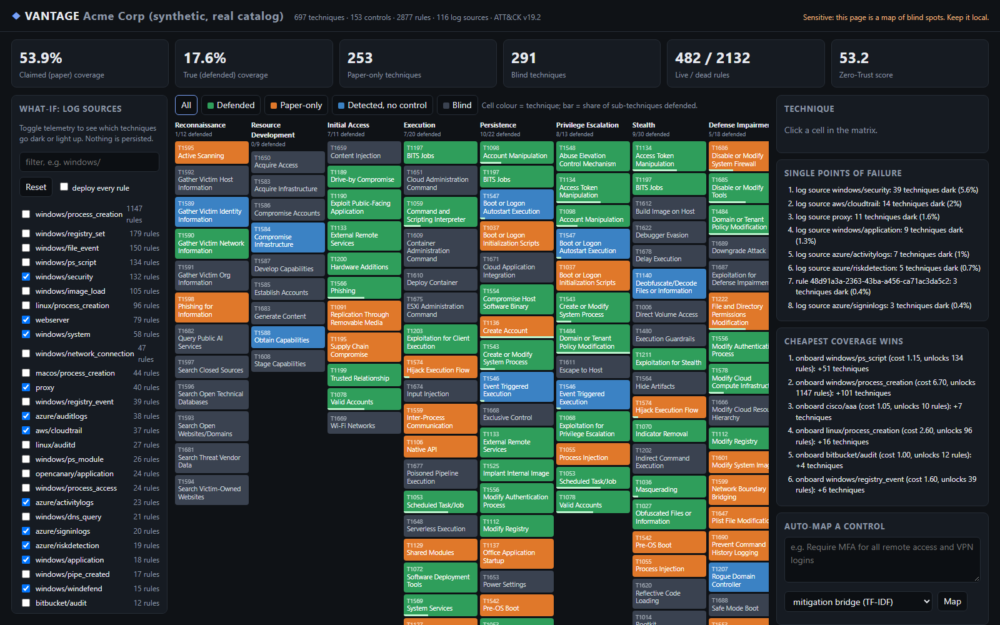

# VANTAGE

**VANTAGE joins your controls, your detections and MITRE ATT&CK into one graph, then shows the
gap between *compliant* and *defensible*.**

**Contribution:** an open, reproducible measurement of how far control-mapping coverage
overstates detection-backed coverage. Each ATT&CK technique is scored as the conjunction of an
official control mapping (CIS v8, NIST SP 800-53B baselines and six CTID frameworks), a deployed
SigmaHQ rule, and that rule's log-source dependencies. Across 12 framework profiles, paper
coverage exceeds detection-backed coverage by **24-56 pp** with classic Windows logs and still by
**11-27 pp** with every Sigma log source
([ablation](evaluation.md#0-ablation-what-each-evidence-requirement-removes)).

[Open the static demo](live-demo.md){ .md-button .md-button--primary }
[How it works](how-it-works.md){ .md-button }
[Evaluation](evaluation.md){ .md-button }
[Reproduce](reproduce.md){ .md-button }

Organisations pass CIS or NIST audits and still get breached, because "we have a control" does
not mean "we can detect the technique it is meant to stop". VANTAGE models the enterprise as a
graph (Control -> Technique <- Detection <- LogSource) with a segmentation/IAM trust layer and
works out which ATT&CK techniques are backed by a working detection and which are covered only on
paper. A technique claimed only by a preventive control may still be blocked, so "paper-only"
means *no detection evidence*, not *exposed*; the evaluation counts those techniques separately.

It runs on real public data: the ATT&CK Enterprise STIX bundle (v19.2), the official CIS
Controls v8 -> ATT&CK mapping, the CTID Mappings Explorer mappings (NIST SP 800-53 rev5, CRI
Profile, CSA CCM, AWS, Azure, GCP, M365), NIST's OSCAL SP 800-53B baselines and the SigmaHQ
ruleset (2,877 ATT&CK-tagged rules).

!!! warning "Lab-only / defensive"
    VANTAGE is a read-only analysis tool that works on a *declared* posture file. It never
    scans, connects to, or changes any system, and it contains no exploit code. The org
    profiles are synthetic. A real posture file and its reports are a map of your blind spots:
    keep them local.

## Headline results

Every number comes from a committed result file produced by the `realdata` GitHub Actions run
[37092934843](https://github.com/rakshit-737/vantage/actions/runs/37092934843) (ubuntu-24.04,
Python 3.12.14).

| Finding | Number |
|---|---|
| Paper minus detection-backed coverage, 12 framework profiles (T0 / T5 telemetry) | 24.1-55.7 pp / 10.9-26.5 pp |
| CIS IG2 claimed vs defended, classic Windows logs only | 53.9% vs 11.2% (42.8 pp gap) |
| Same claims, every Sigma log source ingested | 53.9% vs 37.4% (rule-quality weighted 33.5%) |
| Detection-only (DeTT&CT-style) vs defended, CIS IG2, every log source | 52.1% vs 37.4%; 88 of 115 paper-only techniques have only non-Detect claims |
| All NIST 800-53 rev5 mapped controls claimed, every log source | 66.9% vs 40.3% (26.5 pp gap) |
| Mitigation-bridge auto-mapper (MiniLM) vs official CIS mapping | MAP@200 0.417 [0.357, 0.478]; prior 0.161; bge-small 0.412, paired difference +0.005 [-0.044, +0.054] (no significant difference) |
| Labels from the 7 other frameworks minus zero-shot (paired, Holm-adjusted) | significant on 4 of 8 frameworks (AWS, GCP, M365, CSA CCM) with both TF-IDF and MiniLM |
| NIST SP 800-53B LOW / MODERATE paper coverage | 66.0% / 66.9% of ATT&CK v19.2 |
| Greedy log-source recommender vs exact ILP | equal at all 7 budgets tested |

Details, confidence intervals, paired tests and figures: [Evaluation](evaluation.md).
Try the UI: [static demo](live-demo.md). Prior work: [Related work](related-work.md).

## Where to go next

- [Getting started](getting-started.md): install, download the data, run the demo.
- [Architecture](architecture.md): the graph model and engines.
- [Datasets](datasets.md): versions, licences and citations.
- [Limitations & roadmap](limitations.md): what the numbers do *not* mean.
